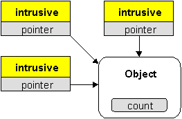
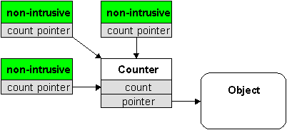
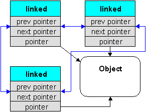

# Smart Pointer

在C++中，通过RAII特性实现智能指针的方式可以分为两种：侵入式智能指针和非侵入式智能指针，这两种实现方式的最重要的区别在于，侵入式智能指针的引用技术是由被管理对象实现的，而非侵入式智能指针的引用技术由智能指针实现。两种智能指针的实现方式各有优劣。如果你对侵入式指针没有明确的需求，那么就应该选择非侵入式指针。

## Intrusive

侵入式智能指针的引用计数在被管理对象中实现。在一般的实现中，侵入式智能指针和被管理对象有如下的关系：

可以看到引用计数count存在于Object中，而intrusive只是保存了一个指向Object的原始指针。侵入式智能指针的优势在于：

1. 可以兼容现有的引用计数方式，比如操作系统或者三方库提供的现成的引用计数方案。
2. 更好的性能，表现在两方面，更低的内存开销以及更快的寻址速度。
3. 与raw pointer可以更好共存。

缺点在于：

1. 无法实现弱指针，不能解决循环引用的问题。
2. 效果取决于被管理对象的引用计数的实现。

## Non-intrusive

非侵入式智能指针的引用计数在被管理对象之外。在一般的实现中，非侵入式指针和被管理对象有如下的关系：

可以看到引用技术是由一个专门的Counter负责管理，这个Counter是由非侵入式智能指针实现的。整个引用技术的过程都是由非侵入式智能指针实现的，而被管理对象对此一无所知，非侵入式智能指针和被管理对象之前的耦合程度非常低。

优势在于：

1. 可以通过weak pointer解决循环引用的问题。
2. 由智能指针实现的统一的，线程安全的引用计数方案，并且这种技术方案是与被管理类解耦的。
3. 不要求被管理对象继承某个基类，或者提供某些方法。

劣势在于：

1. 被管理对象无法决定自己的生死。
2. 暴露出raw pointer通常是有风险的。

## Reference Linking

除了Reference counting之外，还有一种称为Reference linking的技术，

