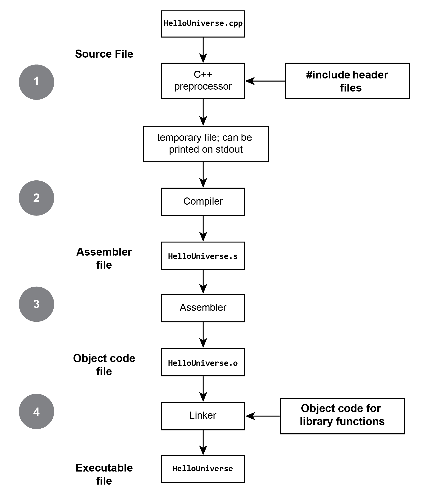

# 鸟瞰

每当论及C++的编译模型，事情就变得沉重起来。这一点都不是开玩笑，为了方便地完成C++的编译，业界发明了数不清的构建系统，但是直到今天都没有一个各方都满意的解决手段。支离破碎的构建系统为C++包管理带来了巨大的困难。首先C++是编译行语言，这就意味着它的编译产物是软硬件相关的。ARM上的软件就不能运行在X86上，Linux上的软件也没法运行在Windows上。当然各种形式的虚拟机和环境模拟另当别论。这样就导致在各个软硬件平台上发布软件是非常困难的事情，你必须编译出符合每一个平台要求的产物。然而各个平台之间上流行的构建系统并不兼容。比如Windows上主流是Visual Studio，而在macOS则是Xcode。而在Linux上，你甚至很难说清楚究竟那个才是“主流”。这样恶性循环的结果就是，C++项目的代码管理和编译几乎达到了写C++代码一样的难度。完全掌握一个构建工具（如CMake）比学习python更难。几乎任何上了规模的C++项目编译都需要借助脚本语言（python或Shell）来完成。Chromium项目组为了管理巨大的C++代码库，甚至从头开始创造了一个编译工具——GN。

## 1. 编译模型

C++是一种编译语言，它的编译模型继承自C语言。那么，C语言的编译模型是怎样的？笼统地说，整个编译流程分为以下几个步骤：

（1）preprocess

    C Preprocessor(CPP)负责预处理，它主要是执行预处理指令。比如`#include`，CPP会将头文件的内容复制到源文件中。经过预处理后的文件又被称为翻译单元（translation unit），翻译单元是一个非常重要的概念，后续会继续提到。

（2）compile

    编译这个概念在C/C++中有狭义和广义之分，狭义的编译指的将经过预处理后的翻译单元编译汇编代码的过程，广义的编译则指的是整个编译流程。

（3）assemble

    汇编指的是将汇编代码翻译成机器码的过程，这一步的产物非常重要，在Linux上称为relocatable object；在macOS中称为mach-O；在windows上称为object。objcet file在不同的操作系统中的具体文件格式都不一样，为了简单，我们统称为obj文件。obj文件是是后续链接阶段的输入物。

（4）link

    链接是整个流程的最后一个步骤，是将前面产生的obj文件进行组装，有三种不同的处理方式：

    （1）链接成exectuable
        如果obj文件中含有entry point，linker就可以生成可执行文件
    （2）链接成shared library
        obj可以组合成shared library，用于在运行时进行链接。
    （3）打包成static library
        所谓static library，本质上就是obj文件的一个压缩包，在Linux下通过`ar`命令进行打包
可以参照如下的图进行理解；


## 2. 实际流程

但是在实际的开发中，常常将预处理，编译，汇编这三个步骤合并，也就是直接从源代码生成obj文件。之后就是直接决定生成静态库，动态库，或者是可执行文件。这样以来就从四个步骤简化为了两个步骤。现代的构建系统流程就是这种流程：

```text
                   |-> executables 
    *.cpp -> *.o ->|-> dynamic libraries
                   |-> static libraries
```
