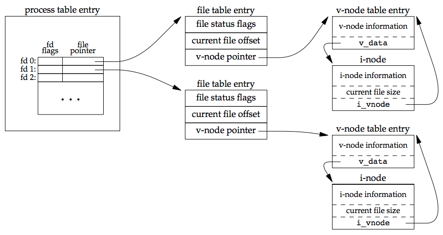

# File System
## 1. 概述
UNIX的内核使用三种数据结构表示打开的文件：

（1）process table entry
    进程表项，用于记录进程使用的文件描述符。其中包括两个重要的项目：一个就是文件的标志位，另外一个就是指向文件表项的指针。

（2）file table entry
    文件表项，内核为所有打开的文件维持一张文件表，每个文件表项包含：文件状态标志（读，写，追加写，同步和阻塞等），文件的偏移量，指向该文件的vnode表项的指针。

（3）v-node table entry
    每个打开的文件都有一个v-node结构，文件类型和对此文件进行各种操作的函数的指针。v-node还包括了i-node。i-node包含了文件的所有者、文件长度、指向文件的实际数据块在磁盘上位置的指针等等。

总的来说，三者之间的关系就如下图所示：

## 文件控制
```C++
#include <sys/stat.h>
int stat(const char *restrict path, struct stat *restric buf);

int fstat(int fd, struct stat *buf);

int lstat(const char *restrict path, struct stat *restrict buf);

int fstatat(int fd, const char *restrict path, struct path *restrict buf, int flag);
```
返回值：成功：返回0；失败，返回-1。

```C++
struct stat{
    mode_t st_mode;           //文件mode，权限控制
    ino_t st_ino;             //i-node序号
    dev_t st_dev;             //设备序号
    dev_t st_rdev;            //设备序号（针对特殊类型的文件）
    nlink_t st_nlink;         //链接的数量
    uid_t st_uid;             //所有者的userid
    gid_t st_gid;             //所有者的groipid
    off_t st_size;            //文件大小
    struct timespec at_time;  //最后一次访问时间
    struct timespec st_mtime; //最后一次修改时间
    struct timespec st_ctime; //最后一次文件状态改变的时间
    blksize_t st_blksize;     //最佳IO块
    blksize_t st_blocks;      //分配的磁盘blocks。
}
```