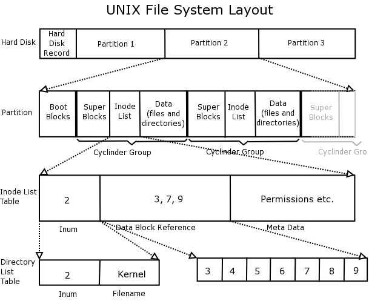

# File Systems

## 设备与设备文件

文件系统主要功能就是管理文件，而文件必须存在于某种存储设备上，因此文件系统就免不了需要和各种存储打交道。在内核中，每种设备都具有与之对应的设备驱动程序，用来处理设备的所有IO请求。倘若文件系统需要以某种形式与设备交互，最理想的一种形式就是将设备抽象成文件，文件系统几乎可以零成本支持各种设备，对文件的各种系统调用也可以拓展到设备上。在文件系统中代表一个设备的文件，被成为设备文件。根据FHS标准，设备文件会放在/dev目录下。

设备可以是实际存在的，也可以是抽象的，通常设备可以分为两种类型：（1）字符设备（2）块设备。
| | 字符设备 | 块设备 |
| - | - | - |
| IO形式 | 不定长字节流 | 定长数据块（512字节） |
| 随机读取 | 不支持 | 支持 |
| 代表设备 | 键鼠 | 硬盘 |

注意，字符设备和块设备的区别由驱动层定义，并非是裸设备决定。

## 设备ID

为了唯一地标识出设备，内核会为各个设备分配一个设备ID，设备ID由主ID和辅助ID组成。主ID用于标识设备的分类，内核会使用主ID查找与该类设备相应的驱动程序，而辅助ID用于在主ID代表的设备等级中定位具体的设备。使用`ls -l`命令，如果是设备文件，则会打印出主ID和辅助ID。

## 磁盘和分区

磁盘是典型的设备，可以支持随机访问，一般以512个字节的数据块作为IO单元，代表了磁盘读写操作的最小信息的单元。可以将磁盘的划分为一个或者多个（不可重叠）的分区。内核会将每个分区视为`/dev`路径下的独立设备。root用户可以使用`fdisk -l`列出磁盘上的所有分区，在Linux上可以使用独有的`/proc/partitions`查看每个磁盘的ID，大小和名称。

磁盘分区一般可以分为以下三种：

1. 文件系统：存储常规文件
2. 数据区域：作为裸设备进行访问
3. 交换分区：交由内核的虚拟内存系统管理

## 文件系统

文件系统是管理文件的程序，Linux中由于虚拟文件系统的存在可以轻松支持种类繁多的文件系统，用于创建文件系统的命令是`mkfs`。在文件系统中，用于分配空间的基本单元是逻辑块，也就是文件系统在磁盘设备上若干连续的物理块。例如，在ext2文件系统上，逻辑块的大小为1024, 2048 或者 4096字节（可以通过mkfs在创建时通过参数设置）。



文件系统具有如上所示的结构，各个组成部分的含义如下所示：

1. Boot Blocks：总是作为文件系统的首个块，文件系统通常不会操作Boot Blocks，只是用来存放用于引导的数据位置。操作系统虽然只需要一个Boot Blocks，但是所有的分区都设有Boot Blocks，只是并未成功启用而已。

2. Super Blocks：包含与文件系统相关参数信息，其中包括：inode table 容量；文件系统中逻辑块的大小；以逻辑块计，文件系统的大小。
3. 驻留在同一设备上的不同文件系统，其类型、大小以及参数设置（比如，块大小）都可以有所不同，因此对磁盘进行分区是必要的。每个系统分区都有自己的 inode table 和 data
文件系统的每个文件或者目录在inode table中具有唯一一条记录，inode记录文件的大量元数据。而data主要就是存放文件中的实际数据的位置，在文件系统中，data的容量占据了主要的部分。

## Inode

"An inode is a data structure on a filesystem on Linux and other Unix-like operating systems that stores all the information about a file except its name and its actual data."

文件和inode之间是唯一对应的关系，每个inode都与一个文件关联，每一个文件都有一个唯一的inode，inode中维护的信息如下：

文件类型：类型有常规文件、目录、符号链接，以及字符设备。

文件属主：用户ID或者UID

文件属组：组ID或者GID

三个访问权限：属主（用户），属组和其他用户（属主和属组之内的其他用户）

三个事件戳：对文件的最后访问(ls -lu)，对文件的最后修改(ls -l，默认)，对文件状态的最后修改(ls -lc，状态修改是指修改inode节点信息)。

指向文件的hard link数量

文件的大小：以字节为单位

实际分配给文件的数据块数量：以512字节为单位，这一数字可能不会简单等同于文件大小，因为考虑文件中存在空洞的情况。

指向数据块的指针。


## 虚拟文件系统

Linux需要支持各种文件系统，其实现的细节均不相同。举例来说，这些差异包括文件块的分配方式，以及目录的组织方式，如果将这些细节暴露给上层应用，会导致严重的移植性，维护性问题。所以为了实现解耦，虚拟文件系统就成了必要的。上层应用调用的IO操作都是虚拟文件系统提供的API，虚拟文件系统支持的系统调用有：`open()`, `write()`, `lseek()`, `close()`, `truncate()`, `stat()`, `mount()`, `mmap()`, `mkdir()`, `link()`, `unlink()`, `symlink()`, `rename()`.上层应用在调用这些API时，虚拟文件系统会将操作交给底层文件系统。

### 文件系统的挂载和卸载

与其他的Unix操作系统一样，Linux上所有文件系统的文件都位于根目录下，其他的文件都是根目录的一个子树，root用户可以使用下面的方式将一个device挂载到给定的directory

```sh
mount device directory
```

direcotry所在的路径有时也被称为挂载点，这个命令中的directory必须存在，否则将挂载失败，至于原因参见Ref.3。

与之相关的系统调用如下所示。

```C++
#include <sys/mount.h>
int mount(char const *source, char const *target, char const *fstype, unsigned long mountflags, void const *data);
```

返回0表示成功，-1标识失败。

同样，文件系统可以卸载，通过调用umount或者umount2卸载掉文件系统。

```C++
int umount(char const *target);

int umount2(char const *target, int flags);
```

如果文件系统中存在打开的文件，那么就会产生EBUSY的错误。

### Directory Entry

在应用层传入的路径会通过VFS转换成Direcoty entry对象，Directory entry对象可以缓存在内存中，所以效率非常高。

## API

### mkfs

### mkswap

### mount

```c
int mount(char const *source, char const *target, char const *fstype, unsigned long mountflags, void const *data);
```

返回值：0成功，-1失败。

### umount

```c
int umount(char const *target);
```

返回值：0成功，-1失败。

## Refs

\[1\]<https://refspecs.linuxfoundation.org/FHS_3.0/fhs/index.html>

\[2\]<http://www.linfo.org/inode.html>

\[3\]<https://unix.stackexchange.com/questions/251090/why-does-mount-happen-over-an-existing-directory>
