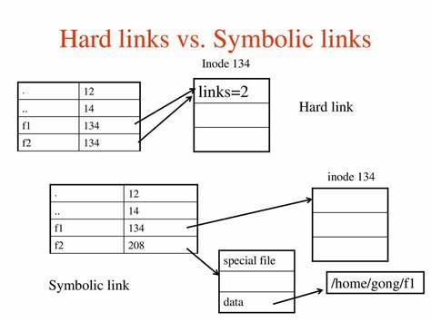

# Directories and Links

## 链接

在Linux中，链接通常分为两种硬链接(hard links)和软链接(soft links)，软件链接又名符号链接，两者具有以下的区别。
|名称|硬链接|软链接|
|-|-|-|
|创建方式| ln TARGET LINK_NAME | ln -s TARGET LINK_NAME |
|跨文件系统| 否 | 是 |
|可链接目录| 否 | 是 |
|inode| 与TARGET相同, 会导致引用+1 | 与TARGET不同，不会导致引用增加 |
|地位 | 与TARGET平等 | 与 TARGET 不等 |
|实质 | 指向了和TARGET相同的inode | 只是一种特殊的文件，里面保存了TARGET的路径|
|删除TARGET后果| inode引用-1 | 变成死链接 |

软链接中保存的路径既可以是相对路径，也可以是绝对路径，相对路径的参照的是软链接所在的目录。

总是会对出现在目录部分的软链接进行接引用操作。

与链接相关的API有：`link()`和`unlink()`,`symlink`和`readlink`

## 目录

TODO

## 拓展

TODO
